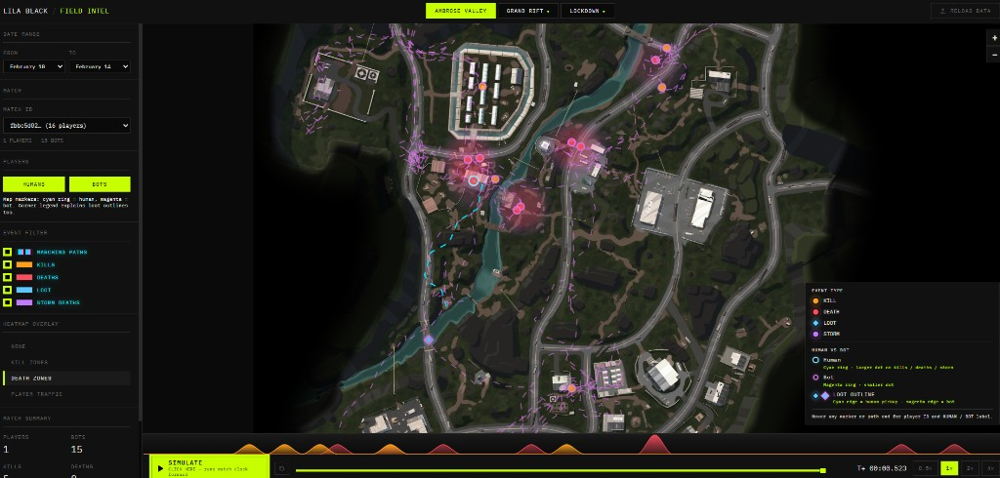
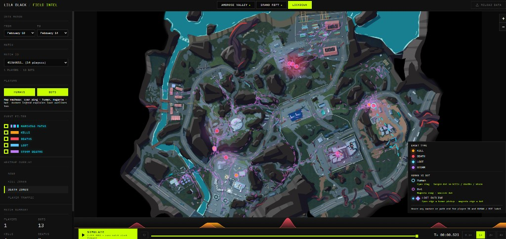
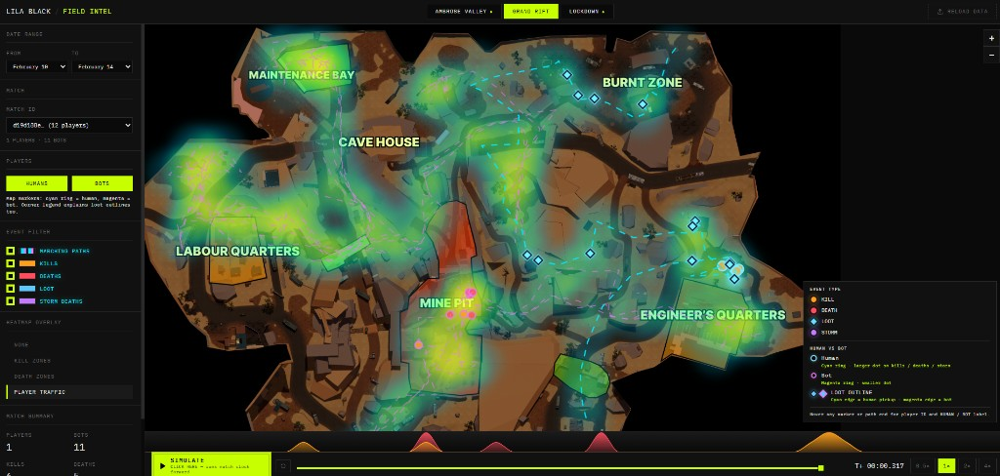

# LILA BLACK — FIELD INTEL

Browser-based **match telemetry explorer** for battle-royale / extraction-style maps: load a ZIP of Parquet shards + minimap art, scrub time, and inspect kills, deaths, loot, storm deaths, and march paths on a 1024×1024 Leaflet overlay.

## Screenshots

From the live app ([lilablackaryan.netlify.app](https://lilablackaryan.netlify.app/)):

### Ambrose Valley — death zones + bot marching paths



### Lockdown — death zones + trails and events



### Grand Rift — player traffic heatmap



---

## Live deployment

**Production:** [https://lilablackaryan.netlify.app/](https://lilablackaryan.netlify.app/)

**Deploy options (static SPA, no server):**

| Host | Notes |
|------|--------|
| **Netlify** | Repo includes `netlify.toml`: `pnpm run build`, publish `dist`, and **COOP/COEP** headers for WASM. Connect repo → deploy. |
| **Vercel** | Repo includes `vercel.json` headers (same COOP/COEP). Framework preset: **Vite**. Output: **`dist`**. Install: `pnpm install` (or enable pnpm on Vercel). |

WASM + SharedArrayBuffer paths used by `parquet-wasm` **require** those security headers in production, not only in dev.

---

## Documentation in this repo

| File | Contents |
|------|----------|
| **[ARCHITECTURE.md](./ARCHITECTURE.md)** | Stack rationale, data pipeline, coordinate mapping, assumptions, tradeoffs (one page). |
| **[INSIGHTS.md](./INSIGHTS.md)** | Three game-design-oriented insights tied to how the tool surfaces patterns. |

---

## Tech stack

| Area | Technology |
|------|------------|
| UI | React 18, TypeScript, Vite 6 |
| Styling | Tailwind CSS v4, `theme.css` tokens |
| Map | Leaflet + custom `CRS.Simple` + `leaflet.heat` |
| Data | JSZip, `parquet-wasm`, Apache Arrow (IPC), Web Workers |
| State | Zustand |
| Charts | Recharts (timeline density strip) |

---

## Environment variables

**None.** The app is fully client-side: no API keys, no `.env` required for build or runtime.

If you fork and add analytics or a backend later, document new variables here.

---

## Setup (local)

```bash
# Install (pnpm preferred — lockfile may be pnpm)
pnpm install
# or: npm install

# Dev server (http://localhost:5173) — COOP/COEP set in vite.config.ts
pnpm run dev

# Production bundle
pnpm run build

# Preview dist/
pnpm run preview
```

---

## Expected data layout (ZIP)

Drop **`player_data.zip`** (or use **LOAD DATA** in the header). Layout:

```
player_data.zip
├── February_10/
│   └── {user_id}_{match_id}.nakama-0   # Parquet-compatible shards
├── February_11/
│   └── …
├── …
└── minimaps/
    ├── AmbroseValley_Minimap.png
    ├── GrandRift_Minimap.png
    └── Lockdown_Minimap.jpg
```

Parquet columns used: `user_id`, `match_id`, `map_id`, `x`, `y`, `z`, `ts`, `event`.

---

## How to use the tool

1. **Load** the ZIP (drag anywhere or use **LOAD DATA**).
2. **Map tab** — Ambrose Valley / Grand Rift / Lockdown (syncs with match data when present).
3. **Match** — Dropdown filters by loaded dates; pick a `matchId`.
4. **Players** — Toggle **HUMANS** / **BOTS** (ring color encodes type on markers).
5. **Event filter** — Kills, deaths, loot, storm deaths, marching paths.
6. **Timeline** — Scrub or **SIMULATE** playback; heatmap overlay: none / kill zones / death zones / traffic.
7. **Legend** (map corner) — Explains marker colors and human vs bot encoding.

---

## Performance / limits

- Parsing runs in a **small worker pool** (up to 4 workers) to keep the tab responsive.
- Large ZIPs: progress UI during extract + parse; very large datasets may need stronger hardware or future chunking work.
- **Human vs bot** is inferred from `user_id` string shape (UUID vs numeric)—see `ARCHITECTURE.md`.

---

## Author

**Aryan Gupta** — Product Engineer take-home: **LILA BLACK / FIELD INTEL**.

---

## License

Private / submission use unless otherwise stated by the author.
